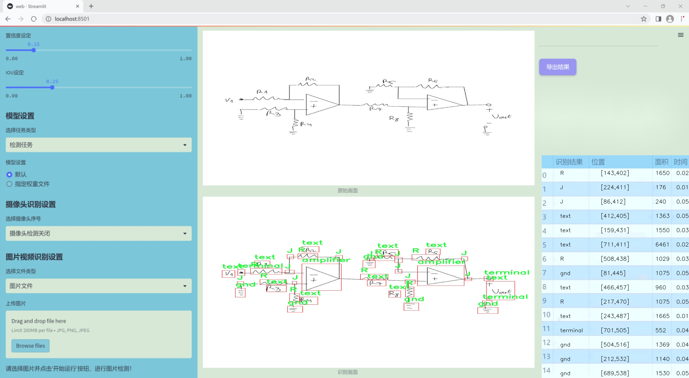
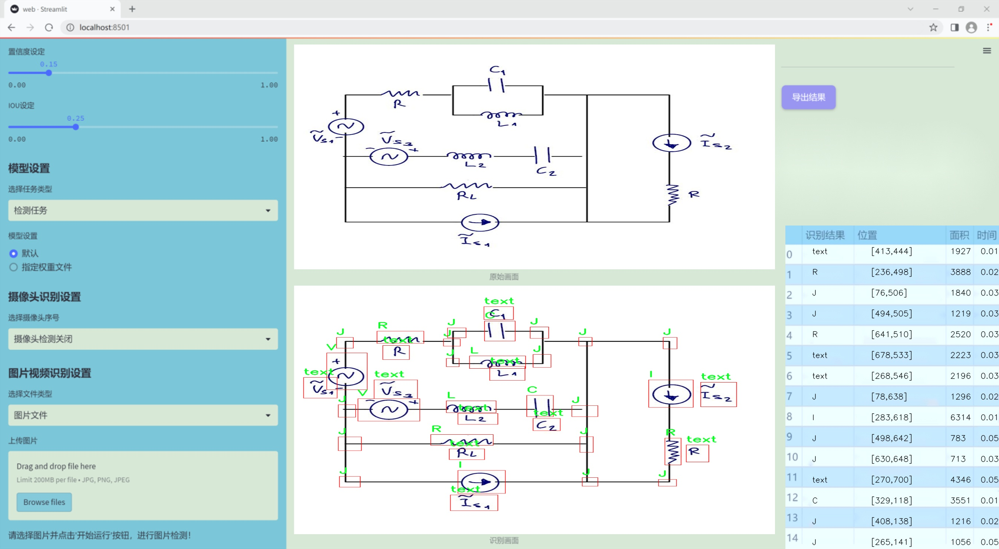
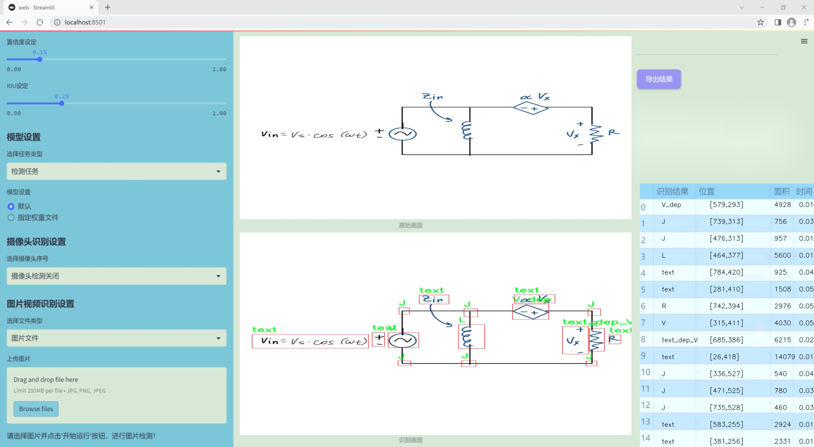
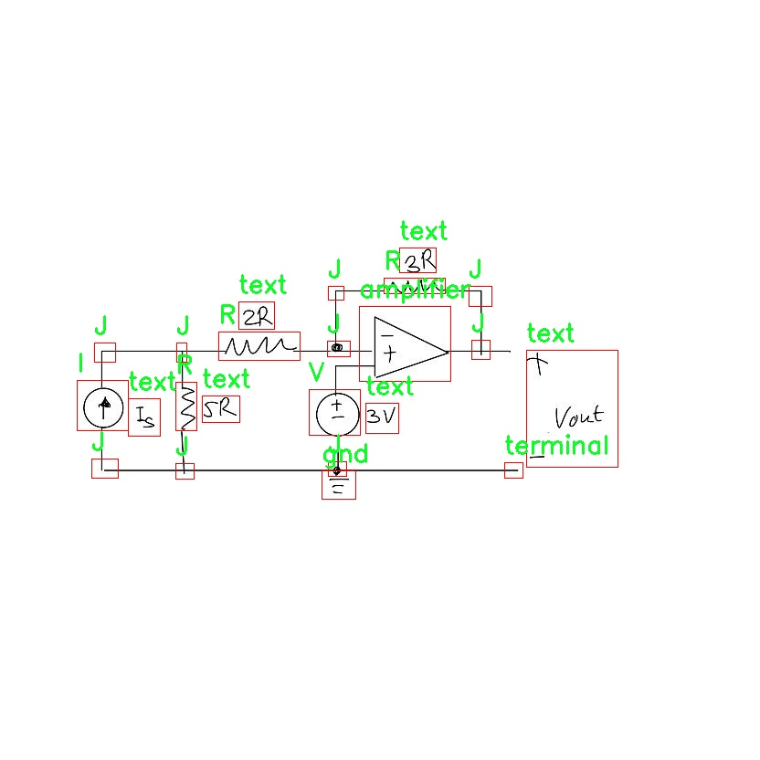
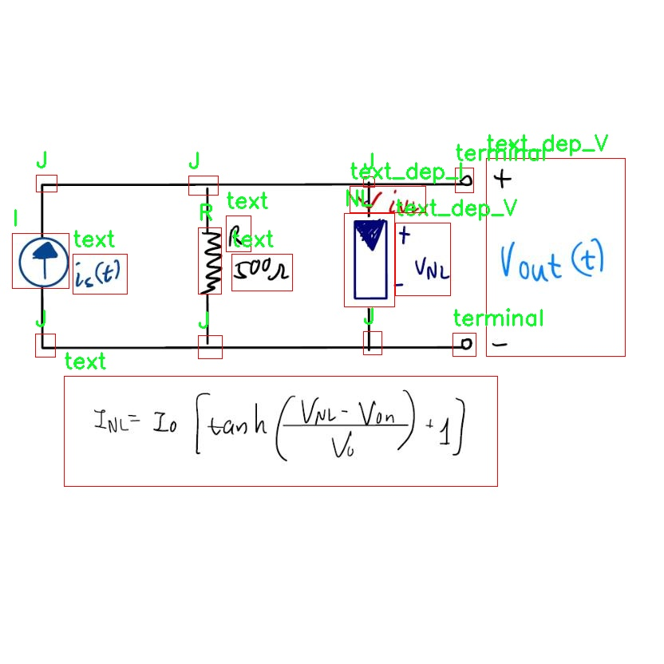
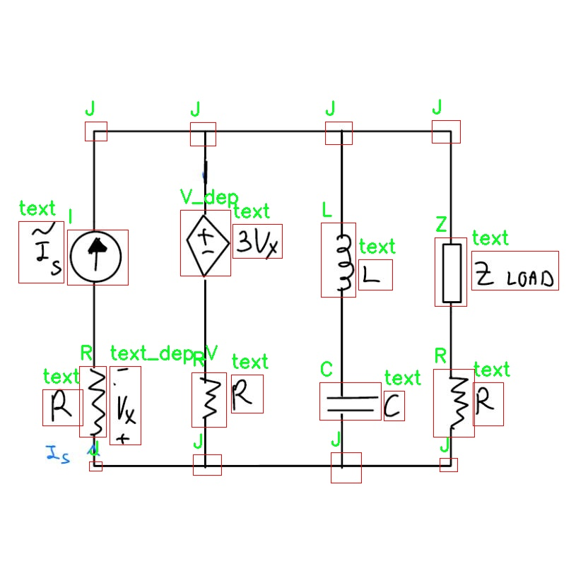
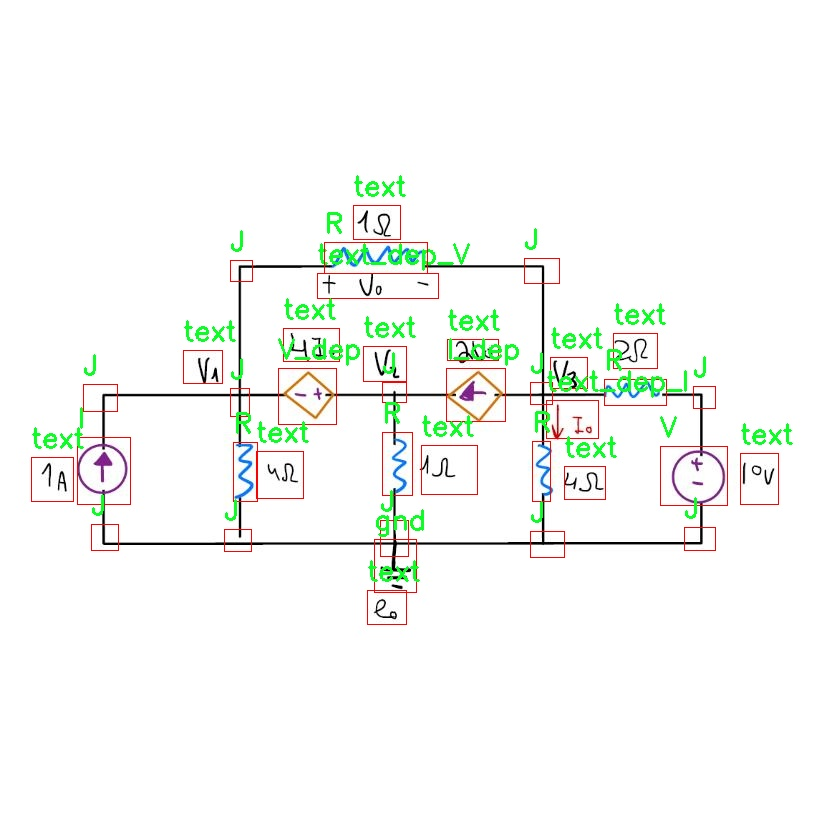
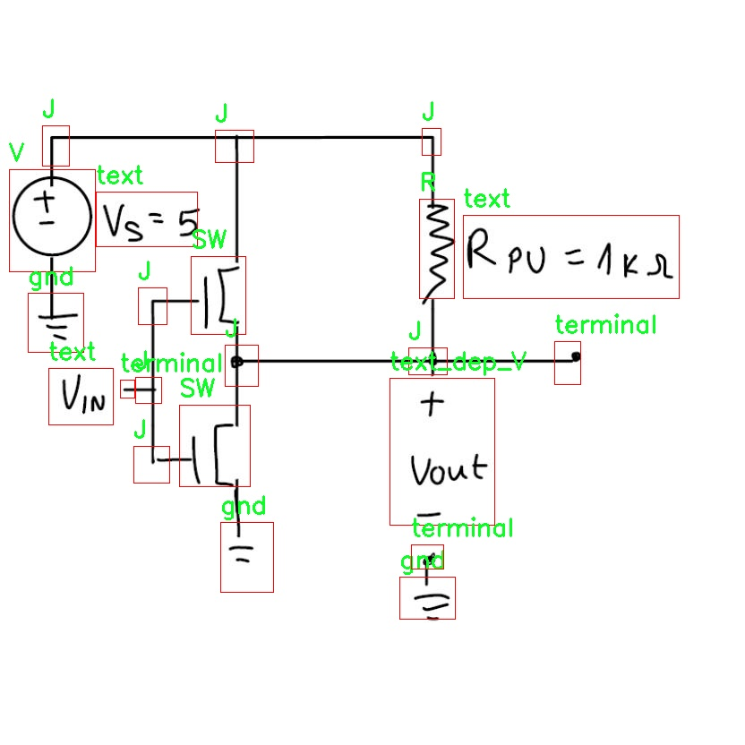

# 改进yolo11-Faster等200+全套创新点大全：电路图电子元件检测系统源码＆数据集全套

### 1.图片效果展示







##### 项目来源 **[人工智能促进会 2024.10.24](https://kdocs.cn/l/cszuIiCKVNis)**

注意：由于项目一直在更新迭代，上面“1.图片效果展示”和“2.视频效果展示”展示的系统图片或者视频可能为老版本，新版本在老版本的基础上升级如下：（实际效果以升级的新版本为准）

  （1）适配了YOLOV11的“目标检测”模型和“实例分割”模型，通过加载相应的权重（.pt）文件即可自适应加载模型。

  （2）支持“图片识别”、“视频识别”、“摄像头实时识别”三种识别模式。

  （3）支持“图片识别”、“视频识别”、“摄像头实时识别”三种识别结果保存导出，解决手动导出（容易卡顿出现爆内存）存在的问题，识别完自动保存结果并导出到tempDir中。

  （4）支持Web前端系统中的标题、背景图等自定义修改。

  另外本项目提供训练的数据集和训练教程,暂不提供权重文件（best.pt）,需要您按照教程进行训练后实现图片演示和Web前端界面演示的效果。

### 2.视频效果展示

[2.1 视频效果展示](https://www.bilibili.com/video/BV1gCy2YKE3D/)

### 3.背景

### 研究背景与意义

随着电子技术的迅猛发展，电路图的设计与分析在现代电子工程中扮演着越来越重要的角色。电路图不仅是电子设备的基础，更是实现复杂电路功能的关键。然而，传统的电路图分析方法往往依赖人工识别和处理，效率低下且容易出错。因此，开发一种高效、准确的电路图电子元件检测系统显得尤为重要。

近年来，深度学习技术在计算机视觉领域取得了显著进展，尤其是目标检测任务中，YOLO（You Only Look Once）系列模型因其高效性和实时性而受到广泛关注。YOLOv11作为该系列的最新版本，具有更强的特征提取能力和更快的处理速度，适合应用于复杂的电路图分析中。通过对YOLOv11模型的改进，我们可以更好地适应电路图中各种电子元件的检测需求。

本研究将基于改进的YOLOv11模型，构建一个电路图电子元件检测系统。我们使用的数据集包含22张电路图，涵盖了多种电子元件类别，如电阻（R）、电容（C）、变压器（transformer）等，以及电路图中的文本信息（text）。这些类别的多样性为模型的训练提供了丰富的样本，能够有效提升检测的准确性和鲁棒性。

本项目的意义在于，不仅能够提高电路图的自动化分析水平，降低人工干预的需求，还能为电子工程师提供更为高效的工具，助力其在设计和故障排查中的工作。同时，基于YOLOv11的改进方案将为目标检测领域的研究提供新的思路，推动深度学习技术在实际应用中的发展。通过这一系统的实现，我们希望能够为电子元件的快速识别和分类提供一种有效的解决方案，进而促进电子设计的智能化进程。

### 4.数据集信息展示

##### 4.1 本项目数据集详细数据（类别数＆类别名）

nc: 19
names: ['C', 'I', 'I_dep', 'J', 'L', 'NL', 'R', 'SW', 'V', 'V_dep', 'Z', 'amplifier', 'cross', 'gnd', 'terminal', 'text', 'text_dep_I', 'text_dep_V', 'transformer']


该项目为【目标检测】数据集，请在【训练教程和Web端加载模型教程（第三步）】这一步的时候按照【目标检测】部分的教程来训练

##### 4.2 本项目数据集信息介绍

本项目数据集信息介绍

本项目所使用的数据集名为“circles”，旨在为改进YOLOv11的电路图电子元件检测系统提供丰富的训练素材。该数据集包含19个类别，涵盖了电路图中常见的电子元件和符号，具体类别包括：电阻（R）、电容（C）、电感（L）、二极管（NL）、开关（SW）、变压器（transformer）、放大器（amplifier）、接地（gnd）、交叉（cross）、端子（terminal）以及各种文本标记（text、text_dep_I、text_dep_V、I、I_dep、V_dep、Z）。这些类别的多样性不仅反映了电路图的复杂性，也为模型的训练提供了多维度的挑战。

在电路图的解析中，各类电子元件和符号的准确识别至关重要。通过使用“circles”数据集，YOLOv11能够学习到不同元件的特征和布局，从而提高其在实际应用中的检测精度。数据集中包含的图像经过精心标注，确保每个类别的样本都具有代表性和多样性，这为模型的泛化能力打下了坚实的基础。

此外，数据集的设计考虑到了电路图的实际应用场景，涵盖了不同风格和复杂度的电路图，使得训练出的模型能够适应各种电路图的识别需求。通过对“circles”数据集的深入学习，改进后的YOLOv11系统将能够在实时电路图分析中表现出色，助力电子工程师和相关领域的专业人士提高工作效率和准确性。总之，“circles”数据集不仅是本项目的核心组成部分，更是推动电路图电子元件检测技术进步的重要资源。











### 5.全套项目环境部署视频教程（零基础手把手教学）

[5.1 所需软件PyCharm和Anaconda安装教程（第一步）](https://www.bilibili.com/video/BV1BoC1YCEKi/?spm_id_from=333.999.0.0&vd_source=bc9aec86d164b67a7004b996143742dc)


[5.2 安装Python虚拟环境创建和依赖库安装视频教程（第二步）](https://www.bilibili.com/video/BV1ZoC1YCEBw?spm_id_from=333.788.videopod.sections&vd_source=bc9aec86d164b67a7004b996143742dc)

### 6.改进YOLOv11训练教程和Web_UI前端加载模型教程（零基础手把手教学）

[6.1 改进YOLOv11训练教程和Web_UI前端加载模型教程（第三步）](https://www.bilibili.com/video/BV1BoC1YCEhR?spm_id_from=333.788.videopod.sections&vd_source=bc9aec86d164b67a7004b996143742dc)


按照上面的训练视频教程链接加载项目提供的数据集，运行train.py即可开始训练



     Epoch   gpu_mem       box       obj       cls    labels  img_size
     1/200     20.8G   0.01576   0.01955  0.007536        22      1280: 100%|██████████| 849/849 [14:42<00:00,  1.04s/it]
               Class     Images     Labels          P          R     mAP@.5 mAP@.5:.95: 100%|██████████| 213/213 [01:14<00:00,  2.87it/s]
                 all       3395      17314      0.994      0.957      0.0957      0.0843

     Epoch   gpu_mem       box       obj       cls    labels  img_size
     2/200     20.8G   0.01578   0.01923  0.007006        22      1280: 100%|██████████| 849/849 [14:44<00:00,  1.04s/it]
               Class     Images     Labels          P          R     mAP@.5 mAP@.5:.95: 100%|██████████| 213/213 [01:12<00:00,  2.95it/s]
                 all       3395      17314      0.996      0.956      0.0957      0.0845

     Epoch   gpu_mem       box       obj       cls    labels  img_size
     3/200     20.8G   0.01561    0.0191  0.006895        27      1280: 100%|██████████| 849/849 [10:56<00:00,  1.29it/s]
               Class     Images     Labels          P          R     mAP@.5 mAP@.5:.95: 100%|███████   | 187/213 [00:52<00:00,  4.04it/s]
                 all       3395      17314      0.996      0.957      0.0957      0.0845


###### [项目数据集下载链接](https://kdocs.cn/l/cszuIiCKVNis)

### 7.原始YOLOv11算法讲解


###### YOLOv11改进方向

与YOLOv 10相比，YOLOv 11有了巨大的改进，包括但不限于：

  * 增强的模型结构：模型具有改进的模型结构，以获取图像处理并形成预测
  * GPU优化：这是现代ML模型的反映，GPU训练ML模型在速度和准确性上都更好。
  * 速度：YOLOv 11模型现在经过增强和GPU优化以用于训练。通过优化，这些模型比它们的前版本快得多。在速度上达到了25%的延迟减少！
  * 更少的参数：更少的参数允许更快的模型，但v11的准确性不受影响
  * 更具适应性：更多支持的任务YOLOv 11支持多种类型的任务、多种类型的对象和多种类型的图像。

###### YOLOv11功能介绍

Glenn Jocher和他的团队制作了一个令人敬畏的YOLOv 11迭代，并且在图像人工智能的各个方面都提供了YOLO。YOLOv 11有多种型号，包括：

  * 对象检测-在训练时检测图像中的对象
  * 图像分割-超越对象检测，分割出图像中的对象
  * 姿态检测-当用点和线训练时绘制一个人的姿势
  * 定向检测（OBB）：类似于对象检测，但包围盒可以旋转
  * 图像分类-在训练时对图像进行分类

使用Ultralytics Library，这些模型还可以进行优化，以：

  * 跟踪-可以跟踪对象的路径
  * 易于导出-库可以以不同的格式和目的导出
  * 多场景-您可以针对不同的对象和图像训练模型

此外，Ultralytics还推出了YOLOv 11的企业模型，该模型将于10月31日发布。这将与开源的YOLOv
11模型并行，但将拥有更大的专有Ultralytics数据集。YOLOv 11是“建立在过去的成功”的其他版本的之上。

###### YOLOv11模型介绍

YOLOv 11附带了边界框模型（无后缀），实例分割（-seg），姿态估计（-pose），定向边界框（-obb）和分类（-cls）。

这些也有不同的尺寸：纳米（n），小（s），中（m），大（l），超大（x）。


YOLOv11模型

###### YOLOv11与前版本对比

与YOLOv10和YOLOv8相比，YOLOv11在Ultralytics的任何帖子中都没有直接提到。所以我会收集所有的数据来比较它们。感谢Ultralytics：

**检测：**


YOLOv11检测统计


YOLOv10检测统计

其中，Nano的mAPval在v11上为39.5，v10上为38.5；Small为47.0 vs 46.3，Medium为51.5 vs
51.1，Large为53.4 vs 53.2，Extra Large为54.7vs
54.4。现在，这可能看起来像是一种增量增加，但小小数的增加可能会对ML模型产生很大影响。总体而言，YOLOv11以0.3
mAPval的优势追平或击败YOLOv10。

现在，我们必须看看速度。在延迟方面，Nano在v11上为1.55 , v10上为1.84，Small为2.46 v2.49，Medium为4.70
v4.74，Large为6.16 v7.28，Extra Large为11.31
v10.70。延迟越低越好。YOLOv11提供了一个非常低的延迟相比，除了特大做得相当差的前身。

总的来说，Nano模型是令人振奋的，速度更快，性能相当。Extra Large在性能上有很好的提升，但它的延迟非常糟糕。

**分割：**


YOLOV11 分割统计


YOLOV9 分割统计


YOLOV8 分割数据

总体而言，YOLOv 11上的分割模型在大型和超大型模型方面比上一代YOLOv 8和YOLOv 9做得更好。

YOLOv 9 Segmentation没有提供任何关于延迟的统计数据。比较YOLOv 11延迟和YOLOv 8延迟，发现YOLOv 11比YOLOv
8快得多。YOLOv 11将大量GPU集成到他们的模型中，因此期望他们的模型甚至比CPU测试的基准更快！

姿态估计：


YOLOV11姿态估计统计


YOLOV8姿态估计统计

YOLOv 11的mAP 50 -95统计量也逐渐优于先前的YOLOv 8（除大型外）。然而，在速度方面，YOLOv
11姿势可以最大限度地减少延迟。其中一些延迟指标是版本的1/4！通过对这些模型进行GPU训练优化，我可以看到指标比显示的要好得多。

**定向边界框：**


YOLOv11 OBB统计


YOLOv8 OBB统计

OBB统计数据在mAP
50上并不是很好，只有非常小的改进，在某种程度上小于检测中的微小改进。然而，从v8到v11的速度减半，这表明YOLOv11在速度上做了很多努力。

**最后，分类：**


YOLOv 11 CLS统计


YOLOv8 CLS统计

从v8到v11，准确性也有了微小的提高。然而，速度大幅上升，CPU速度更快的型号。


### 8.200+种全套改进YOLOV11创新点原理讲解

#### 8.1 200+种全套改进YOLOV11创新点原理讲解大全

由于篇幅限制，每个创新点的具体原理讲解就不全部展开，具体见下列网址中的改进模块对应项目的技术原理博客网址【Blog】（创新点均为模块化搭建，原理适配YOLOv5~YOLOv11等各种版本）

[改进模块技术原理博客【Blog】网址链接](https://gitee.com/qunmasj/good)


#### 8.2 精选部分改进YOLOV11创新点原理讲解

###### 这里节选部分改进创新点展开原理讲解(完整的改进原理见上图和[改进模块技术原理博客链接](https://gitee.com/qunmasj/good)【如果此小节的图加载失败可以通过CSDN或者Github搜索该博客的标题访问原始博客，原始博客图片显示正常】

### 动态蛇形卷积Dynamic Snake Convolution

参考论文： 2307.08388.pdf (arxiv.org)

血管、道路等拓扑管状结构的精确分割在各个领域都至关重要，确保下游任务的准确性和效率。 然而，许多因素使任务变得复杂，包括薄的局部结构和可变的全局形态。在这项工作中，我们注意到管状结构的特殊性，并利用这些知识来指导我们的 DSCNet 在三个阶段同时增强感知：特征提取、特征融合、 和损失约束。 首先，我们提出了一种动态蛇卷积，通过自适应地关注细长和曲折的局部结构来准确捕获管状结构的特征。 随后，我们提出了一种多视图特征融合策略，以补充特征融合过程中多角度对特征的关注，确保保留来自不同全局形态的重要信息。 最后，提出了一种基于持久同源性的连续性约束损失函数，以更好地约束分割的拓扑连续性。 2D 和 3D 数据集上的实验表明，与多种方法相比，我们的 DSCNet 在管状结构分割任务上提供了更好的准确性和连续性。 我们的代码是公开的。 
主要的挑战源于细长微弱的局部结构特征与复杂多变的全局形态特征。本文关注到管状结构细长连续的特点，并利用这一信息在神经网络以下三个阶段同时增强感知：特征提取、特征融合和损失约束。分别设计了动态蛇形卷积（Dynamic Snake Convolution），多视角特征融合策略与连续性拓扑约束损失。 

我们希望卷积核一方面能够自由地贴合结构学习特征，另一方面能够在约束条件下不偏离目标结构太远。在观察管状结构的细长连续的特征后，脑海里想到了一个动物——蛇。我们希望卷积核能够像蛇一样动态地扭动，来贴合目标的结构。

我们希望卷积核一方面能够自由地贴合结构学习特征，另一方面能够在约束条件下不偏离目标结构太远。在观察管状结构的细长连续的特征后，脑海里想到了一个动物——蛇。我们希望卷积核能够像蛇一样动态地扭动，来贴合目标的结构。


### DCNV2融入YOLOv11
DCN和DCNv2（可变性卷积）
网上关于两篇文章的详细描述已经很多了，我这里具体的细节就不多讲了，只说一下其中实现起来比较困惑的点。（黑体字会讲解）

DCNv1解决的问题就是我们常规的图像增强，仿射变换（线性变换加平移）不能解决的多种形式目标变换的几何变换的问题。如下图所示。

可变性卷积的思想很简单，就是讲原来固定形状的卷积核变成可变的。如下图所示：


首先来看普通卷积，以3x3卷积为例对于每个输出y(p0)，都要从x上采样9个位置，这9个位置都在中心位置x(p0)向四周扩散得到的gird形状上，(-1,-1)代表x(p0)的左上角，(1,1)代表x(p0)的右下角，其他类似。

用公式表示如下：


可变性卷积Deformable Conv操作并没有改变卷积的计算操作，而是在卷积操作的作用区域上，加入了一个可学习的参数∆pn。同样对于每个输出y(p0)，都要从x上采样9个位置，这9个位置是中心位置x(p0)向四周扩散得到的，但是多了 ∆pn，允许采样点扩散成非gird形状。


偏移量是通过对原始特征层进行卷积得到的。比如输入特征层是w×h×c，先对输入的特征层进行卷积操作，得到w×h×2c的offset field。这里的w和h和原始特征层的w和h是一致的，offset field里面的值是输入特征层对应位置的偏移量，偏移量有x和y两个方向，所以offset field的channel数是2c。offset field里的偏移量是卷积得到的，可能是浮点数，所以接下来需要通过双向性插值计算偏移位置的特征值。在偏移量的学习中，梯度是通过双线性插值来进行反向传播的。
看到这里是不是还是有点迷茫呢？那到底程序上面怎么实现呢？


事实上由上面的公式我们可以看得出来∆pn这个偏移量是加在原像素点上的，但是我们怎么样从代码上对原像素点加这个量呢？其实很简单，就是用一个普通的卷积核去跟输入图片（一般是输入的feature_map）卷积就可以了卷积核的数量是2N也就是23*3==18（前9个通道是x方向的偏移量，后9个是y方向的偏移量），然后把这个卷积的结果与正常卷积的结果进行相加就可以了。
然后又有了第二个问题，怎么样反向传播呢？为什么会有这个问题呢？因为求出来的偏移量+正常卷积输出的结果往往是一个浮点数，浮点数是无法对应到原图的像素点的，所以自然就想到了双线性差值的方法求出浮点数对应的浮点像素点。


#### DCN v2
对于positive的样本来说，采样的特征应该focus在RoI内，如果特征中包含了过多超出RoI的内容，那么结果会受到影响和干扰。而negative样本则恰恰相反，引入一些超出RoI的特征有助于帮助网络判别这个区域是背景区域。

DCNv1引入了可变形卷积，能更好的适应目标的几何变换。但是v1可视化结果显示其感受野对应位置超出了目标范围，导致特征不受图像内容影响（理想情况是所有的对应位置分布在目标范围以内）。

为了解决该问题：提出v2, 主要有

1、扩展可变形卷积，增强建模能力
2、提出了特征模拟方案指导网络培训：feature mimicking scheme

上面这段话是什么意思呢，通俗来讲就是，我们的可变性卷积的区域大于目标所在区域，所以这时候就会对非目标区域进行错误识别。

所以自然能想到的解决方案就是加入权重项进行惩罚。（至于这个实现起来就比较简单了，直接初始化一个权重然后乘(input+offsets)就可以了）


可调节的RoIpooling也是类似的，公式如下：


### 9.系统功能展示

图9.1.系统支持检测结果表格显示

  图9.2.系统支持置信度和IOU阈值手动调节

  图9.3.系统支持自定义加载权重文件best.pt(需要你通过步骤5中训练获得)

  图9.4.系统支持摄像头实时识别

  图9.5.系统支持图片识别

  图9.6.系统支持视频识别

  图9.7.系统支持识别结果文件自动保存

  图9.8.系统支持Excel导出检测结果数据


### 10. YOLOv11核心改进源码讲解

#### 10.1 prepbn.py

以下是对代码的逐文件分析，保留了核心部分并进行了详细的中文注释：

```python
import torch
import torch.nn as nn

# 定义一个自定义的批归一化层，带有可学习的参数
class RepBN(nn.Module):
    def __init__(self, channels):
        super(RepBN, self).__init__()
        # 初始化一个可学习的参数 alpha，初始值为1
        self.alpha = nn.Parameter(torch.ones(1))
        # 初始化一个一维批归一化层
        self.bn = nn.BatchNorm1d(channels)

    def forward(self, x):
        # 将输入的维度进行转置，以适应 BatchNorm1d 的输入格式
        x = x.transpose(1, 2)
        # 进行批归一化，并加上 alpha 乘以输入 x
        x = self.bn(x) + self.alpha * x
        # 再次转置回原来的维度
        x = x.transpose(1, 2)
        return x

# 定义一个线性归一化层，支持不同的归一化方法
class LinearNorm(nn.Module):
    def __init__(self, dim, norm1, norm2, warm=0, step=300000, r0=1.0):
        super(LinearNorm, self).__init__()
        # 注册缓冲区，用于存储预热步数和迭代步数
        self.register_buffer('warm', torch.tensor(warm))
        self.register_buffer('iter', torch.tensor(step))
        self.register_buffer('total_step', torch.tensor(step))
        self.r0 = r0  # 初始比例
        # 初始化两个归一化方法
        self.norm1 = norm1(dim)
        self.norm2 = norm2(dim)

    def forward(self, x):
        if self.training:  # 如果模型处于训练模式
            if self.warm > 0:  # 如果还有预热步数
                self.warm.copy_(self.warm - 1)  # 减少预热步数
                x = self.norm1(x)  # 使用第一个归一化方法
            else:
                # 计算当前的比例因子 lamda
                lamda = self.r0 * self.iter / self.total_step
                if self.iter > 0:
                    self.iter.copy_(self.iter - 1)  # 减少迭代步数
                # 使用两个归一化方法进行归一化
                x1 = self.norm1(x)
                x2 = self.norm2(x)
                # 按照比例因子 lamda 进行线性组合
                x = lamda * x1 + (1 - lamda) * x2
        else:
            # 如果模型不在训练模式，直接使用第二个归一化方法
            x = self.norm2(x)
        return x
```

### 核心部分分析：
1. **RepBN 类**：实现了一个自定义的批归一化层，除了标准的批归一化外，还引入了一个可学习的参数 `alpha`，使得模型可以在训练过程中自适应调整输入的权重。

2. **LinearNorm 类**：实现了一个线性归一化层，支持两种不同的归一化方法，并通过预热和迭代步数来控制归一化的方式。在训练初期使用 `norm1` 进行归一化，之后根据迭代次数线性插值在 `norm1` 和 `norm2` 之间切换。

这个文件定义了两个神经网络模块：`RepBN` 和 `LinearNorm`，它们都是基于 PyTorch 框架构建的。

首先，`RepBN` 类是一个自定义的批量归一化层。它的构造函数接收一个参数 `channels`，表示输入数据的通道数。在初始化过程中，它创建了一个可学习的参数 `alpha`，并实例化了一个标准的 `BatchNorm1d` 层。`forward` 方法是该模块的前向传播逻辑。输入 `x` 首先通过 `transpose` 方法调整维度，使得通道维度变为最后一维，然后应用批量归一化层 `self.bn`。接着，将归一化后的结果与 `alpha` 乘以原始输入 `x` 相加，最后再将结果的维度调整回来。这种结构允许模型在批量归一化的基础上引入一个可学习的加权因子，从而增强模型的表达能力。

接下来是 `LinearNorm` 类，它实现了一种线性归一化策略。构造函数接收多个参数，包括 `dim`（维度）、`norm1` 和 `norm2`（两个归一化函数）、`warm`（预热步数）、`step`（总步数）和 `r0`（初始比例因子）。在初始化时，它使用 `register_buffer` 方法注册了一些张量，这些张量不会被视为模型的参数，但会在模型的状态中保存。`forward` 方法根据模型的训练状态执行不同的操作。如果模型处于训练状态且预热步数大于零，则会调用 `norm1` 对输入 `x` 进行归一化。如果预热步数为零，则计算一个动态的比例因子 `lamda`，这个因子随着训练步数的变化而变化。接着，分别对输入 `x` 应用 `norm1` 和 `norm2`，并根据 `lamda` 线性组合这两个归一化的结果。如果模型不在训练状态，则直接使用 `norm2` 对输入进行归一化。

总的来说，这两个模块提供了灵活的归一化方法，`RepBN` 通过引入可学习的参数增强了批量归一化的效果，而 `LinearNorm` 则通过动态调整归一化策略来适应不同的训练阶段。这些模块可以在深度学习模型中用于改善训练过程和提升模型性能。

#### 10.2 CSwomTramsformer.py

以下是提取后的核心代码部分，并附上详细的中文注释：

```python
import torch
import torch.nn as nn
import numpy as np

class Mlp(nn.Module):
    """多层感知机（MLP）模块"""
    def __init__(self, in_features, hidden_features=None, out_features=None, act_layer=nn.GELU, drop=0.):
        super().__init__()
        out_features = out_features or in_features  # 输出特征数
        hidden_features = hidden_features or in_features  # 隐藏层特征数
        self.fc1 = nn.Linear(in_features, hidden_features)  # 第一层线性变换
        self.act = act_layer()  # 激活函数
        self.fc2 = nn.Linear(hidden_features, out_features)  # 第二层线性变换
        self.drop = nn.Dropout(drop)  # Dropout层

    def forward(self, x):
        """前向传播"""
        x = self.fc1(x)  # 线性变换
        x = self.act(x)  # 激活
        x = self.drop(x)  # Dropout
        x = self.fc2(x)  # 线性变换
        x = self.drop(x)  # Dropout
        return x

class LePEAttention(nn.Module):
    """局部增强注意力模块"""
    def __init__(self, dim, resolution, num_heads, split_size=7, attn_drop=0.):
        super().__init__()
        self.dim = dim  # 输入特征维度
        self.resolution = resolution  # 输入分辨率
        self.split_size = split_size  # 切分窗口大小
        self.num_heads = num_heads  # 注意力头数
        head_dim = dim // num_heads  # 每个头的维度
        self.scale = head_dim ** -0.5  # 缩放因子
        self.get_v = nn.Conv2d(dim, dim, kernel_size=3, stride=1, padding=1, groups=dim)  # 卷积层用于获取值

    def im2cswin(self, x):
        """将输入转换为窗口形式"""
        B, N, C = x.shape  # B: 批量大小, N: 序列长度, C: 特征维度
        H = W = int(np.sqrt(N))  # 计算高度和宽度
        x = x.transpose(-2, -1).contiguous().view(B, C, H, W)  # 转换形状
        # 切分窗口
        x = img2windows(x, self.split_size, self.split_size)
        return x

    def forward(self, qkv):
        """前向传播"""
        q, k, v = qkv  # 获取查询、键、值
        q = self.im2cswin(q)  # 将查询转换为窗口形式
        k = self.im2cswin(k)  # 将键转换为窗口形式
        # 计算注意力
        attn = (q @ k.transpose(-2, -1)) * self.scale  # 计算注意力分数
        attn = nn.functional.softmax(attn, dim=-1)  # 归一化
        x = attn @ v  # 应用注意力
        return x

class CSWinBlock(nn.Module):
    """CSWin Transformer的基本模块"""
    def __init__(self, dim, num_heads, split_size=7):
        super().__init__()
        self.attn = LePEAttention(dim, resolution=split_size, num_heads=num_heads)  # 注意力层
        self.mlp = Mlp(in_features=dim, hidden_features=dim * 4)  # MLP层
        self.norm1 = nn.LayerNorm(dim)  # 归一化层
        self.norm2 = nn.LayerNorm(dim)  # 归一化层

    def forward(self, x):
        """前向传播"""
        x = self.norm1(x)  # 归一化
        x = x + self.attn(x)  # 添加注意力输出
        x = x + self.mlp(self.norm2(x))  # 添加MLP输出
        return x

class CSWinTransformer(nn.Module):
    """CSWin Transformer模型"""
    def __init__(self, img_size=640, in_chans=3, num_classes=1000, embed_dim=96, depth=[2, 2, 6, 2], num_heads=12):
        super().__init__()
        self.stage1_conv_embed = nn.Sequential(
            nn.Conv2d(in_chans, embed_dim, kernel_size=7, stride=4, padding=2),  # 卷积嵌入
            nn.LayerNorm(embed_dim)  # 归一化
        )
        self.stage1 = nn.ModuleList([
            CSWinBlock(dim=embed_dim, num_heads=num_heads) for _ in range(depth[0])  # 第一阶段的多个CSWinBlock
        ])
        # 其他阶段的初始化略去...

    def forward(self, x):
        """前向传播"""
        x = self.stage1_conv_embed(x)  # 卷积嵌入
        for blk in self.stage1:
            x = blk(x)  # 通过每个CSWinBlock
        return x

# 下面的代码是模型的实例化和测试
if __name__ == '__main__':
    inputs = torch.randn((1, 3, 640, 640))  # 随机输入
    model = CSWinTransformer()  # 实例化模型
    res = model(inputs)  # 前向传播
    print(res.size())  # 输出结果的尺寸
```

### 代码说明：
1. **Mlp类**：实现了一个简单的多层感知机，包括两个线性层和一个激活函数，支持Dropout。
2. **LePEAttention类**：实现了局部增强注意力机制，包含输入的窗口化处理和注意力计算。
3. **CSWinBlock类**：构建了CSWin Transformer的基本模块，包含注意力层和MLP层。
4. **CSWinTransformer类**：整体模型的实现，包含输入嵌入和多个CSWinBlock的堆叠。
5. **主函数**：用于测试模型的输入和输出。

这段代码展示了CSWin Transformer的核心结构和前向传播的实现，注释详细解释了每个模块的功能和作用。

这个程序文件 `CSWinTransformer.py` 实现了 CSWin Transformer 模型，这是一个用于计算机视觉任务的深度学习模型。该模型结合了卷积神经网络（CNN）和自注意力机制，旨在提高图像处理的效率和准确性。

首先，文件导入了必要的库，包括 PyTorch 及其相关模块、一些图像处理和模型注册的工具。文件中定义了一些常量和函数，用于后续模型的构建和初始化。

接下来，定义了多个类。`Mlp` 类实现了一个多层感知机（MLP），包含两个线性层和一个激活函数（默认为 GELU），用于在 Transformer 中进行特征变换。`LePEAttention` 类实现了局部增强自注意力机制，允许模型在处理图像时关注局部特征。该类的构造函数中定义了多个参数，包括维度、分辨率、头数等，并包含图像到窗口的转换和窗口到图像的转换功能。

`CSWinBlock` 类是 CSWin Transformer 的基本构建块，结合了自注意力机制和 MLP。它通过规范化层和残差连接来增强模型的表现。`Merge_Block` 类用于在不同阶段合并特征图，帮助模型逐步提取更高层次的特征。

`CSWinTransformer` 类是整个模型的核心部分，负责构建整个网络架构。它包括多个阶段，每个阶段由多个 CSWinBlock 组成，并通过 Merge_Block 进行特征合并。模型的初始化函数中定义了输入图像的大小、嵌入维度、深度等参数，并使用循环构建每个阶段的模块。

此外，文件中还定义了一些辅助函数，例如 `_conv_filter` 用于转换权重，`update_weight` 用于更新模型权重，确保模型能够加载预训练的权重。

最后，文件提供了几个函数（如 `CSWin_tiny`、`CSWin_small`、`CSWin_base` 和 `CSWin_large`）用于创建不同规模的 CSWin Transformer 模型，并支持加载预训练权重。在 `__main__` 部分，代码示例展示了如何实例化这些模型并进行前向传播，输出各个模型的特征图大小。

整体而言，这个文件实现了一个复杂的视觉 Transformer 模型，结合了现代深度学习技术，适用于图像分类等任务。

#### 10.3 VanillaNet.py

以下是简化后的核心代码，并附上详细的中文注释：

```python
import torch
import torch.nn as nn
import torch.nn.functional as F
from timm.layers import weight_init

# 定义激活函数类
class Activation(nn.ReLU):
    def __init__(self, dim, act_num=3, deploy=False):
        super(Activation, self).__init__()
        self.deploy = deploy
        # 初始化权重
        self.weight = torch.nn.Parameter(torch.randn(dim, 1, act_num*2 + 1, act_num*2 + 1))
        self.bn = nn.BatchNorm2d(dim, eps=1e-6)  # 批归一化
        weight_init.trunc_normal_(self.weight, std=.02)  # 权重初始化

    def forward(self, x):
        # 前向传播
        if self.deploy:
            return F.conv2d(super(Activation, self).forward(x), self.weight, padding=(self.act_num*2 + 1)//2, groups=self.dim)
        else:
            return self.bn(F.conv2d(super(Activation, self).forward(x), self.weight, padding=self.act_num, groups=self.dim))

    def switch_to_deploy(self):
        # 切换到部署模式，融合批归一化
        if not self.deploy:
            kernel, bias = self._fuse_bn_tensor(self.weight, self.bn)
            self.weight.data = kernel
            self.bias = torch.nn.Parameter(torch.zeros(self.dim))
            self.bias.data = bias
            self.__delattr__('bn')  # 删除bn属性
            self.deploy = True

    def _fuse_bn_tensor(self, weight, bn):
        # 融合批归一化的权重和偏置
        running_mean = bn.running_mean
        running_var = bn.running_var
        gamma = bn.weight
        beta = bn.bias
        eps = bn.eps
        std = (running_var + eps).sqrt()
        t = (gamma / std).reshape(-1, 1, 1, 1)
        return weight * t, beta - running_mean * gamma / std

# 定义网络块
class Block(nn.Module):
    def __init__(self, dim, dim_out, act_num=3, stride=2, deploy=False):
        super().__init__()
        self.deploy = deploy
        if self.deploy:
            self.conv = nn.Conv2d(dim, dim_out, kernel_size=1)  # 部署模式下的卷积
        else:
            self.conv1 = nn.Sequential(
                nn.Conv2d(dim, dim, kernel_size=1),
                nn.BatchNorm2d(dim, eps=1e-6),
            )
            self.conv2 = nn.Sequential(
                nn.Conv2d(dim, dim_out, kernel_size=1),
                nn.BatchNorm2d(dim_out, eps=1e-6)
            )
        self.pool = nn.MaxPool2d(stride) if stride != 1 else nn.Identity()  # 池化层
        self.act = Activation(dim_out, act_num)  # 激活函数

    def forward(self, x):
        # 前向传播
        if self.deploy:
            x = self.conv(x)
        else:
            x = self.conv1(x)
            x = F.leaky_relu(x, negative_slope=1)  # 使用Leaky ReLU激活
            x = self.conv2(x)

        x = self.pool(x)  # 池化
        x = self.act(x)  # 激活
        return x

    def switch_to_deploy(self):
        # 切换到部署模式
        if not self.deploy:
            kernel, bias = self._fuse_bn_tensor(self.conv1[0], self.conv1[1])
            self.conv = self.conv2[0]  # 更新卷积层
            self.conv.weight.data = kernel
            self.conv.bias.data = bias
            self.__delattr__('conv1')
            self.__delattr__('conv2')
            self.act.switch_to_deploy()  # 切换激活函数
            self.deploy = True

# 定义主网络结构
class VanillaNet(nn.Module):
    def __init__(self, in_chans=3, num_classes=1000, dims=[96, 192, 384, 768], strides=[2, 2, 2, 1], deploy=False):
        super().__init__()
        self.deploy = deploy
        if self.deploy:
            self.stem = nn.Sequential(
                nn.Conv2d(in_chans, dims[0], kernel_size=4, stride=4),
                Activation(dims[0])
            )
        else:
            self.stem1 = nn.Sequential(
                nn.Conv2d(in_chans, dims[0], kernel_size=4, stride=4),
                nn.BatchNorm2d(dims[0], eps=1e-6),
            )
            self.stem2 = nn.Sequential(
                nn.Conv2d(dims[0], dims[0], kernel_size=1, stride=1),
                nn.BatchNorm2d(dims[0], eps=1e-6),
                Activation(dims[0])
            )

        self.stages = nn.ModuleList()
        for i in range(len(strides)):
            stage = Block(dim=dims[i], dim_out=dims[i + 1], stride=strides[i], deploy=deploy)
            self.stages.append(stage)

    def forward(self, x):
        # 前向传播
        if self.deploy:
            x = self.stem(x)
        else:
            x = self.stem1(x)
            x = F.leaky_relu(x, negative_slope=1)
            x = self.stem2(x)

        for stage in self.stages:
            x = stage(x)  # 通过每个阶段
        return x

    def switch_to_deploy(self):
        # 切换到部署模式
        if not self.deploy:
            self.stem2[2].switch_to_deploy()
            self.deploy = True

# 示例用法
if __name__ == '__main__':
    inputs = torch.randn((1, 3, 640, 640))  # 输入数据
    model = VanillaNet()  # 创建模型
    pred = model(inputs)  # 前向传播
    print(pred.size())  # 输出预测结果的尺寸
```

### 代码说明：
1. **Activation 类**：自定义的激活函数类，包含了权重初始化、前向传播、批归一化融合等功能。
2. **Block 类**：构建网络的基本模块，包含卷积层、池化层和激活函数，支持部署模式和训练模式的切换。
3. **VanillaNet 类**：主网络结构，包含多个 Block 组件，负责整体的前向传播和参数的初始化。
4. **switch_to_deploy 方法**：用于将模型从训练模式切换到部署模式，融合批归一化层以提高推理效率。
5. **示例用法**：在主程序中创建一个输入张量并通过模型进行前向传播，输出结果的尺寸。

这个程序文件名为 `VanillaNet.py`，它实现了一个名为 VanillaNet 的深度学习模型，主要用于图像处理任务。该模型是基于 PyTorch 框架构建的，包含了一些特定的模块和功能，以提高模型的性能和灵活性。

首先，文件中引入了必要的库，包括 PyTorch 的核心库、神经网络模块以及一些辅助功能，如权重初始化和 DropPath。文件开头包含版权信息和使用许可，说明该程序是开源的，可以在 MIT 许可证下使用。

接下来，定义了一个名为 `activation` 的类，它继承自 `nn.ReLU`。这个类实现了一个自定义的激活函数，具有可学习的权重和偏置，并且支持批归一化。该类的 `forward` 方法根据模型的部署状态选择不同的计算路径，确保在训练和推理阶段都能正确处理输入数据。此外，`switch_to_deploy` 方法用于将模型切换到推理模式，融合批归一化的参数。

然后，定义了一个名为 `Block` 的类，表示模型中的基本构建块。每个块包含两个卷积层和一个激活层。根据是否处于部署模式，`Block` 类的构造函数会选择不同的层结构。`forward` 方法定义了块的前向传播过程，并在需要时应用池化操作。该类同样提供了参数融合的功能，以便在推理时提高计算效率。

接下来是 `VanillaNet` 类的定义，它是整个模型的核心。该类接受输入通道数、类别数、维度、丢弃率、激活函数数量、步幅等参数，并根据这些参数构建模型的结构。模型的前向传播方法会依次通过每个阶段进行处理，并根据输入大小记录特征图。该类还包含了权重初始化和切换到部署模式的功能。

文件中还定义了一些函数，如 `update_weight`，用于更新模型的权重，确保模型能够加载预训练的权重。接着，定义了一系列函数（如 `vanillanet_5` 到 `vanillanet_13_x1_5_ada_pool`），这些函数用于创建不同配置的 VanillaNet 模型，并支持加载预训练权重。

最后，在文件的主程序部分，创建了一个随机输入，并实例化了一个 VanillaNet 模型（例如 `vanillanet_10`），并对输入进行前向传播，输出每个特征图的尺寸。

总体而言，这个程序实现了一个灵活且高效的深度学习模型，适用于各种图像处理任务，并提供了多种配置选项和预训练权重加载的功能。

#### 10.4 starnet.py

以下是代码中最核心的部分，并附上详细的中文注释：

```python
import torch
import torch.nn as nn
from timm.models.layers import DropPath, trunc_normal_

# 定义一个卷积层和批归一化层的组合
class ConvBN(torch.nn.Sequential):
    def __init__(self, in_planes, out_planes, kernel_size=1, stride=1, padding=0, dilation=1, groups=1, with_bn=True):
        super().__init__()
        # 添加卷积层
        self.add_module('conv', torch.nn.Conv2d(in_planes, out_planes, kernel_size, stride, padding, dilation, groups))
        # 如果需要，添加批归一化层
        if with_bn:
            self.add_module('bn', torch.nn.BatchNorm2d(out_planes))
            # 初始化批归一化层的权重和偏置
            torch.nn.init.constant_(self.bn.weight, 1)
            torch.nn.init.constant_(self.bn.bias, 0)

# 定义一个基本的网络块
class Block(nn.Module):
    def __init__(self, dim, mlp_ratio=3, drop_path=0.):
        super().__init__()
        # 深度可分离卷积
        self.dwconv = ConvBN(dim, dim, 7, 1, (7 - 1) // 2, groups=dim, with_bn=True)
        # 两个1x1卷积层
        self.f1 = ConvBN(dim, mlp_ratio * dim, 1, with_bn=False)
        self.f2 = ConvBN(dim, mlp_ratio * dim, 1, with_bn=False)
        # 另一个1x1卷积层
        self.g = ConvBN(mlp_ratio * dim, dim, 1, with_bn=True)
        # 第二个深度可分离卷积
        self.dwconv2 = ConvBN(dim, dim, 7, 1, (7 - 1) // 2, groups=dim, with_bn=False)
        self.act = nn.ReLU6()  # 激活函数
        self.drop_path = DropPath(drop_path) if drop_path > 0. else nn.Identity()  # 随机深度

    def forward(self, x):
        input = x  # 保存输入
        x = self.dwconv(x)  # 通过深度可分离卷积
        x1, x2 = self.f1(x), self.f2(x)  # 通过两个1x1卷积
        x = self.act(x1) * x2  # 元素级乘法
        x = self.dwconv2(self.g(x))  # 通过第二个深度可分离卷积
        x = input + self.drop_path(x)  # 残差连接
        return x

# 定义StarNet模型
class StarNet(nn.Module):
    def __init__(self, base_dim=32, depths=[3, 3, 12, 5], mlp_ratio=4, drop_path_rate=0.0, num_classes=1000, **kwargs):
        super().__init__()
        self.num_classes = num_classes
        self.in_channel = 32
        # stem层
        self.stem = nn.Sequential(ConvBN(3, self.in_channel, kernel_size=3, stride=2, padding=1), nn.ReLU6())
        dpr = [x.item() for x in torch.linspace(0, drop_path_rate, sum(depths))]  # 随机深度
        # 构建各个阶段
        self.stages = nn.ModuleList()
        cur = 0
        for i_layer in range(len(depths)):
            embed_dim = base_dim * 2 ** i_layer  # 计算当前层的嵌入维度
            down_sampler = ConvBN(self.in_channel, embed_dim, 3, 2, 1)  # 下采样层
            self.in_channel = embed_dim
            blocks = [Block(self.in_channel, mlp_ratio, dpr[cur + i]) for i in range(depths[i_layer])]  # 构建块
            cur += depths[i_layer]
            self.stages.append(nn.Sequential(down_sampler, *blocks))  # 添加到阶段中
        
        self.channel = [i.size(1) for i in self.forward(torch.randn(1, 3, 640, 640))]  # 计算通道数
        self.apply(self._init_weights)  # 初始化权重

    def _init_weights(self, m):
        # 权重初始化
        if isinstance(m, (nn.Linear, nn.Conv2d)):
            trunc_normal_(m.weight, std=.02)  # 截断正态分布初始化
            if isinstance(m, nn.Linear) and m.bias is not None:
                nn.init.constant_(m.bias, 0)  # 偏置初始化为0
        elif isinstance(m, (nn.LayerNorm, nn.BatchNorm2d)):
            nn.init.constant_(m.bias, 0)  # 偏置初始化为0
            nn.init.constant_(m.weight, 1.0)  # 权重初始化为1.0

    def forward(self, x):
        features = []  # 特征列表
        x = self.stem(x)  # 通过stem层
        features.append(x)  # 保存特征
        for stage in self.stages:
            x = stage(x)  # 通过每个阶段
            features.append(x)  # 保存特征
        return features  # 返回所有特征

# 定义不同规模的StarNet模型
def starnet_s1(pretrained=False, **kwargs):
    model = StarNet(24, [2, 2, 8, 3], **kwargs)  # 创建模型
    return model

def starnet_s2(pretrained=False, **kwargs):
    model = StarNet(32, [1, 2, 6, 2], **kwargs)  # 创建模型
    return model

def starnet_s3(pretrained=False, **kwargs):
    model = StarNet(32, [2, 2, 8, 4], **kwargs)  # 创建模型
    return model

def starnet_s4(pretrained=False, **kwargs):
    model = StarNet(32, [3, 3, 12, 5], **kwargs)  # 创建模型
    return model
```

### 代码说明：
1. **ConvBN类**：封装了卷积层和批归一化层的组合，便于构建网络。
2. **Block类**：实现了StarNet的基本构建块，包含深度可分离卷积和元素级乘法的操作。
3. **StarNet类**：定义了整个网络结构，包括stem层和多个阶段，每个阶段由多个Block组成。
4. **权重初始化**：使用截断正态分布初始化卷积层和线性层的权重。
5. **前向传播**：通过stem层和各个阶段提取特征，返回所有阶段的特征。

该程序文件实现了一个名为StarNet的神经网络模型，主要用于深度学习任务。文件开头包含了文档字符串，简要介绍了StarNet的设计理念，强调了其简化的网络结构和训练过程，以突出元素级乘法的关键贡献。作者是Xu Ma，并提供了联系邮箱和修改日期。

在导入部分，程序使用了PyTorch库以及timm库中的一些模块，如DropPath和trunc_normal_。接下来，定义了一个包含多个模型的列表，便于后续调用。

程序中定义了多个类。首先是`ConvBN`类，它是一个组合模块，包含卷积层和可选的批归一化层。构造函数中设置了卷积的参数，并对批归一化的权重和偏置进行了初始化。

接着是`Block`类，代表StarNet中的基本构建块。该类包含多个卷积层和激活函数，以及一个元素级乘法操作。`forward`方法定义了数据在该块中的前向传播过程，利用深度可分离卷积和ReLU6激活函数进行特征提取。

`StarNet`类是模型的主体，构造函数中定义了网络的基本结构，包括输入层、多个阶段和各个块的组合。它使用了随机深度的概念，以增强模型的泛化能力。`_init_weights`方法用于初始化网络权重，采用截断正态分布。

在`forward`方法中，输入数据经过各个阶段的处理，最终返回特征列表。

随后，程序定义了多个函数，如`starnet_s1`、`starnet_s2`等，这些函数用于创建不同规模的StarNet模型，并提供了加载预训练权重的选项。每个函数根据不同的参数配置实例化`StarNet`类，并在需要时从指定的URL加载预训练模型的权重。

最后，程序还定义了几个非常小的网络版本，如`starnet_s050`、`starnet_s100`和`starnet_s150`，以适应不同的应用场景和计算资源需求。

整体而言，该程序文件展示了StarNet模型的结构和实现细节，提供了灵活的模型构建方式，并为用户提供了预训练模型的加载功能。

注意：由于此博客编辑较早，上面“10.YOLOv11核心改进源码讲解”中部分代码可能会优化升级，仅供参考学习，以“11.完整训练+Web前端界面+200+种全套创新点源码、数据集获取”的内容为准。

### 11.完整训练+Web前端界面+200+种全套创新点源码、数据集获取


# [下载链接：https://mbd.pub/o/bread/Zp6Tm5hq](https://mbd.pub/o/bread/Zp6Tm5hq)